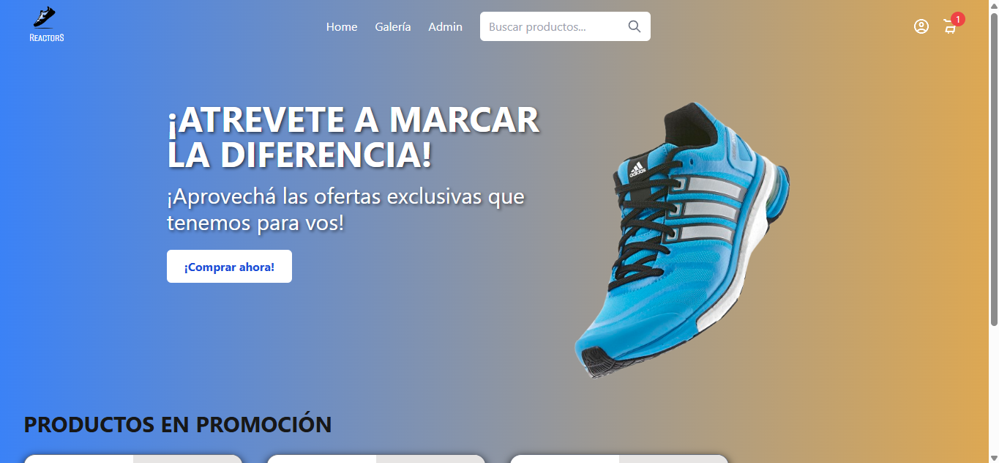
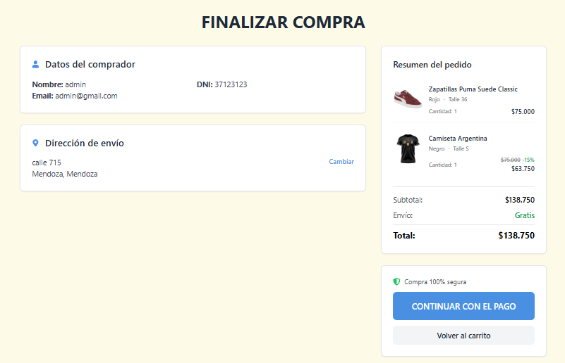

# E-commerce de Indumentaria
 Proyecto desarrollado en la Tecnicatura Universitaria en Programación - UTN: Se trata de una aplicación web (E-commerce) de venta de indumentaria, construida con React - TypeScript, conectada a un backend en Java - Spring Boot. Incluye autenticación, panel de administración y las funcionalidades esenciales de un e-commerce moderno.

## Tecnologías utilizadas
- React

- TypeScript

- React Router

- Axios

- Redux Toolkit

- JWT para autenticación

- Tailwind-CSS

- MercadoPago SDK para procesamiento de pagos

## Backend:
https://github.com/Fix404/Final-metodologia-backend.git

## Funcionalidades principales
**Autenticación:**
- Registro e inicio de sesión con validaciones

- Uso de JWT para proteger rutas

- Roles: USER y ADMIN

**Catálogo y carrito:**
- Filtros por categoría, talle, tipo y precio

- Búsqueda por nombre

- Detalle del producto con selector de talle y cantidad y visualización de stock, precio y/o descuento 

- Carrito persistente 

- Validación de stock al agregar y confirmar compra

**Órdenes de compra**
- Envío de orden al backend

- Pantalla de confirmación

- Limpieza automática del carrito

- Integración de MercadoPago

**Panel de administración**
- Gestión de productos, categorías y usuarios

- Visualización de estadísticas de ventas

**Protección de rutas**
- Rutas protegidas según rol (ADMIN / USER)

- Redirección automática si el usuario no está autenticado

# Configuración y ejecución

Asegurarse de tener el backend corriendo antes de iniciar el frontend, ya que la aplicación depende de la API para funcionar correctamente:

## Ejecución del backend:

**1. Clonar el repositorio**

git clone https://github.com/Fix404/Final-metodologia-backend.git

cd Final-metodologia-backend

**2. Crear la base de datos**

Crear base de datos persistence_db en MySQL:

CREATE DATABASE persistence_db;

**3. Ejecutar el proyecto**

./mvnw spring-boot:run

Para Maven global:

mvn spring-boot:run

**1. Clonar el repositorio**

git clone https://github.com/Fix404/Final-metodologia-frontend.git

cd ecommerce-zapatillas-frontend

**2. Instalar dependencias**

npm install

**3. Configurar variables de entorno**

Este proyecto incluye un archivo `.env` con la siguiente variable: `API_URL="http://localhost:8080/auth"` 

Este valor está configurado para uso local. Si estás probando el proyecto en un entorno diferente, asegurate de que el servidor backend esté corriendo en esa URL, o modificá el valor de API_URL según corresponda.

**4. Ejecutar proyecto**

npm run dev

La aplicación estará disponible en http://localhost:5173 (o el puerto configurado).

## Vistas previas
**Landing Page**

**Catálogo de productos**

**Detalle del producto**

**Carrito de compras**

**Pantalla de pago**

**Panel de administración**

**Otros**

## Autores
Sofía Ferraro

Maximiliano Niscola

Camila Irisarri

Julieta Sena
